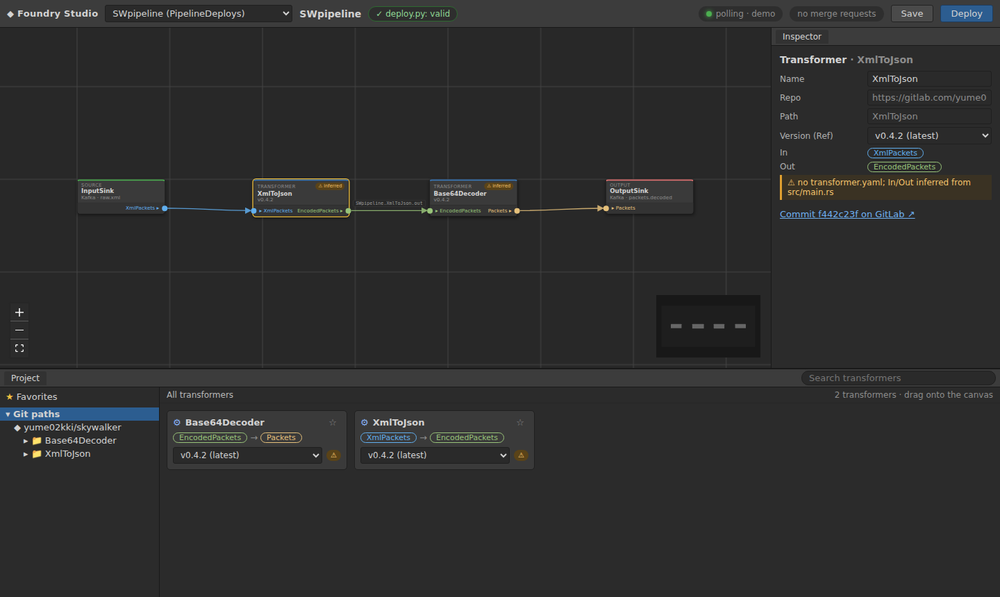

# Foundry Studio

A visual pipeline builder for the foundry GitOps pipelines, in the spirit of Palantir Foundry's
Pipeline Builder. Browse transformers in an asset panel, drag them onto a canvas, wire
**Source → transformers → Output**, and deploy. GitLab is watched live, so a transformer that's
committed and pushed shows up (or shows an update) without a reload.



- **Backend:** Python + FastAPI (`backend/`). It imports foundry's `deploy.py` as a library, so the
  UI and the CLI can't disagree about what a valid pipeline is.
- **Frontend:** React + TypeScript + Vite, with React Flow (`@xyflow/react`) for the canvas (`frontend/`).
- **foundry** is pinned as a git submodule at `vendor/foundry` (commit `b126193`, foundry `main`).

## Quick start

Requirements: Python ≥ 3.11 with [uv](https://docs.astral.sh/uv/), Node ≥ 20, and git.

```sh
make setup                          # submodule + Python and Node dependencies

export GITLAB_TOKEN=glpat-…         # see "GitLab token" below
make dev                            # backend :8000 + frontend :5173, both auto-reloading
```

Open <http://127.0.0.1:5173>. `make dev` runs `scripts/dev.sh`, which starts both servers and
stops them together on Ctrl-C.

### Offline demo (no token)

```sh
make demo
```

The demo serves local git repositories that stand in for skywalker and PipelineDeploys
(`.demo-gitlab/`). PipelineDeploys/SWpipeline in the demo is rendered by the real `deploy.py` from
foundry's `PipelineManifest.yaml`, and Deploy really runs `deploy.py deploy --pr` against it. To
see the live updates, "push" from another terminal:

```sh
cd backend
uv run python -m foundry_studio.demo tag Base64Decoder v0.4.3       # update badge appears
uv run python -m foundry_studio.demo add Deduplicate Packets Packets  # a new card appears
uv run python -m foundry_studio.demo ci 1 failed                     # MR chip turns red
make demo-reset                                                      # start over
```

The skywalker crates in the demo are stand-ins with the same shape as the real ones (the real
repo is private), so their commit SHAs and image tags differ from production.

## GitLab token

The token is read from the `GITLAB_TOKEN` environment variable only. It is never written to disk,
logged, or put in a URL. git gets it through a credential helper that reads the variable when git
asks (`backend/foundry_studio/gitenv.py`).

| Scope | Needed for |
|---|---|
| `read_api` | Discovery, watching (events, tags, merge requests, CI status), loading pipelines |
| `read_repository` | `deploy.py` cloning transformer repos at their pinned Ref (Validate needs no clone) |
| `write_repository` | Deploy: pushing the `deploy/<Name>/<id>` branch to PipelineDeploys |
| `api` | Deploy: opening the merge request |

A personal access token with `read_api` and `read_repository` is enough to browse and validate.
Add `write_repository` and `api` to deploy. Nothing is written to GitLab except when you click
**Deploy**. **Save** writes locally (see below).

## Deploying to a server

```sh
scripts/deploy_server.sh ubuntu@<host>          # from your machine, in this checkout
ssh -N -L 8000:127.0.0.1:8000 ubuntu@<host>      # then open http://localhost:8000
```

The script builds the frontend, copies the app to `/opt/foundry-studio` with rsync, installs `uv`
and the backend's dependencies, and runs it as the `foundry-studio` systemd service. Studio has
no login, so the service listens on **127.0.0.1 only**. Reach it through the SSH tunnel; don't
expose port 8000 publicly. The token goes in `/etc/foundry-studio.env` (mode 600,
`GITLAB_TOKEN=…`). The script creates that file but never sends a token. Re-run the script to
update.

## Configuration

All configuration comes from environment variables; the defaults fit the yume02kki projects.

| Variable | Default | |
|---|---|---|
| `GITLAB_TOKEN` | – | See above |
| `GITLAB_URL` | `https://gitlab.com` | Self-hosted GitLab works too |
| `STUDIO_TRANSFORMER_PROJECTS` | `yume02kki/skywalker` | Comma-separated projects to scan for transformer crates |
| `STUDIO_DEPLOYS_PROJECT` | `yume02kki/PipelineDeploys` | The GitOps repo |
| `STUDIO_DEPLOYS_BASE` | `main` | Branch deploys are made against |
| `STUDIO_POLL_INTERVAL` | `10` | Seconds between polls |
| `STUDIO_FULL_RESCAN_INTERVAL` | `300` | Full rescan even without events |
| `GITLAB_WEBHOOK_SECRET` | – | Enables `/api/webhooks/gitlab` |
| `STUDIO_WORKSPACE` | `./workspace` | Where Save writes drafts |
| `STUDIO_FAKE_GITLAB` | – | `demo`, or a directory of local repos (tests, e2e) |
| `STUDIO_KAFKA_CLUSTERS` | – | YAML file mapping the manifest's sink `Brokers` to where they really are, in the watcher's `clusters:` format (a watcher.yaml works); without it Live data connects to the manifest's settings as written |
| `FOUNDRY_SECRETS_DIR` | `/var/run/secrets/foundry` | Kafka credentials for Live data: `<dir>/<SecretRef>/username` and `/password`, as the transformer runtime reads them |
| `FOUNDRY_DIR` | `./vendor/foundry` | Use another foundry checkout |

## Real-time updates

The watcher always **polls**, which is what you get on localhost, where GitLab can't reach you.
Every `STUDIO_POLL_INTERVAL` seconds (10 by default) it reads each project's events API, plus
`last_activity_at`. GitLab only refreshes `last_activity_at` about once an hour, so it's only a
backstop. A push or tag event on a transformer project triggers a rescan. The rescan is diffed
against the previous one and sent to the browser over Server-Sent Events (`/api/events`):

- `transformer.added`, `transformer.updated` (with any new version tags), `transformer.removed`
- `mr.updated`: the latest PipelineDeploys merge request and its CI status
- `pipelines.changed`: PipelineDeploys' default branch moved

A new tag reaches the browser within one poll interval plus the rescan, so about 10–15 s.

### Webhooks (optional, faster)

When GitLab can reach the backend (a deployed instance, or a tunnel such as
`ngrok http 8000`), add a webhook to **skywalker** and **PipelineDeploys**:

1. Pick a secret and start the backend with `GITLAB_WEBHOOK_SECRET=<secret>`.
2. In GitLab, open the project's **Settings → Webhooks → Add new webhook**:
   - URL: `https://<your host>/api/webhooks/gitlab`
   - Secret token: `<secret>` (it arrives as `X-Gitlab-Token` and is compared in constant time)
   - Triggers: **Push events**, **Tag push events**, **Merge request events**, **Pipeline events**
3. Use **Test → Push events** in GitLab. It should get `202`, and the live chip in the top bar
   switches to `webhook+polling`.

Webhook deliveries trigger the same rescans as polling, which stays on as a safety net.

## Live data

Press **Live data** in the top bar. Studio follows every topic of the pipeline (the Source, each
transformer's output and the Output) and the canvas comes alive:

- connections animate while data flows through the topic they carry;
- each transformer shows `N in → M out/min` and how many records it dropped; the sinks show their rate;
- the **Overview** in the bottom panel lists every stage with its status, rates, drops and last
  message. A transformer that receives input but produces nothing is flagged **Not producing**.

Then click to drill in. A **node** shows its data, a **connection** shows the messages on its topic,
and **empty canvas** goes back to the Overview. The stage strip above the panel does the same.

- **A transformer** shows its input records next to its output records. They're matched by record
  key: the Kafka key, which foundry-schemas sets to the packet `guid`, or else a `guid`/`id` field in
  the payload. Each row says whether the record was transformed, is still pending, or was **dropped**
  (no output after 5 s; Base64Decoder drops packets that aren't UTF-8 text). It also shows what
  changed, e.g. `XML→JSON`, or `data` from base64 to text. Click a row for the field-by-field diff and
  both payloads side by side. The header shows in/min, out/min, transformed and dropped counts.
- **Source / Output** show that topic's messages.
- **Status:** **Flowing · N/min** means messages were produced in the last minute. **Quiet** means
  connected, but nothing recent. **Error** means, e.g., brokers unreachable or authentication failed.
  It keeps retrying, so it recovers by itself. Each node on the canvas shows the status of the topic
  it writes.
- Every message is checked against its topic's schema: the sink's Ontology, or the transformer's
  `OUT` for internal topics, field by field as foundry's YAML schemas define (`format` + `fields`,
  e.g. `guid: uuid`, `data: base64`): exactly those fields, each of its type. Older pipelines' JSON
  Schema files are validated too; XSDs get a well-formedness check.

A transformer's input and output topics come from deploy.py's `endpoint_id`. Internal topics
(`<Pipeline>.<Transformer>.out`) use `Defaults.InternalDatasets.ConnectionSettings`; the sinks use
their own.

It shows the last few messages of each partition, then follows new ones. It's **read-only**: Studio
assigns partitions directly under a throwaway group id. It never joins the pipeline's `ConsumerGroup`,
which would take partitions away from the real consumers, and never commits offsets. The connection
settings are mapped exactly as the transformer runtime maps them (`backend/foundry_studio/peek.py`).
SASL credentials come from `$FOUNDRY_SECRETS_DIR/<SecretRef>/username` and `/password` (for SWpipeline: the
upstream, downstream and `kafka-internal-creds` secrets):

```sh
mkdir -p ~/.foundry-secrets/upstream-kafka-creds ~/.foundry-secrets/downstream-kafka-creds
printf '%s' 'user' > ~/.foundry-secrets/upstream-kafka-creds/username   # likewise password, downstream
export FOUNDRY_SECRETS_DIR=~/.foundry-secrets
```

The machine running the backend must be able to reach the brokers (e.g. `upstream-kafka:9092`,
`kafka-internal:9092`).
In demo mode the feeds show generated sample messages, labelled **demo data**.

## How it works

### deploy.py is the source of truth

`backend/foundry_studio/foundry.py` imports `vendor/foundry/deploy.py` with importlib.
`load_pipeline` and `ManifestError` drive validation, `render` and `deploy` drive Deploy, and
`endpoint_id` names the internal topics. Nothing re-implements a rule:

- **Validate:** the graph is written as a manifest exactly as Deploy would write it, staged next to
  its schema files, and passed to `deploy.load_pipeline`. The top bar shows deploy.py's errors
  verbatim. Clicking one selects and zooms to the node or edge it names.
- **Wiring:** while you drag a wire, compatible ports light up and incompatible ones dim, with a
  tooltip such as `XmlToJson emits EncodedPackets but OutputSink expects Packets`. This uses a small
  client-side mirror of the per-edge rules (`frontend/src/lib/rules.ts`) because it runs on every
  mouse move. When you drop the wire, the backend asks deploy.py (`/api/check-edge` runs
  `_validate_graph` on the candidate edge) and refuses with deploy.py's exact message, e.g.
  `Relation 'XmlToJson -> OutputSink': type mismatch — XmlToJson emits EncodedPackets but OutputSink expects Packets`.
- **Deploy** runs `deploy.deploy(manifest, PipelineDeploys, base="main", push=True, pr=True)`, the
  same as `deploy.py deploy --repo … --pr`, and reports the merge request URL, or
  "already up to date". `deploy.py` opens the MR with `glab`. If `glab` isn't installed, the backend
  puts a small stand-in on its own `PATH` that implements `glab mr create` with the GitLab API.

### The manifest

The manifest format is the contract with deploy.py, and Studio doesn't extend it. The UI graph is
the manifest's own sections plus nodes and edges for `Transformers` and `Relation`
(`backend/foundry_studio/manifest.py`).

Manifests are written in one **canonical form**: the layout and comments of foundry's
`PipelineManifest.yaml`, transformers and edges in topological order (ties broken by name, as in
deploy.py), and connection keys in the runtime's documented order. The same pipeline therefore
always produces the same bytes, however it was dragged and wired. That makes the `deploy.py render`
of a rebuilt SWpipeline byte-identical to the deployed one, so its Deploy is a no-op. The cost is
that hand-written comments in a loaded manifest aren't preserved.

Internal datasets (`<Pipeline>.<Transformer>.out`) and the pipeline-level settings (`Registry`,
`Defaults.InternalDatasets`, `Schemas`) aren't shown or edited in the UI. They come from the loaded
manifest, or for a new pipeline from foundry's example manifest, and are written back unchanged. The
pipeline's name is edited in place in the top bar. Click a connection to see and edit its Kafka connection settings: InputSink's
or OutputSink's own for the sink topics, or `Defaults.InternalDatasets.ConnectionSettings` (shared by all
internal topics) for connections between transformers. Sinks have a `SecretRef` field and no password
field, and deploy.py rejects credential-like keys anyway.

### Save, drafts and layout

**Save** writes a local draft:

```
workspace/<Name>/manifest.yaml
workspace/<Name>/<Name>.layout.json     # node positions: the sidecar, not in the manifest
workspace/<Name>/schemas/…               # so `deploy.py validate workspace/<Name>/manifest.yaml` works as-is
```

Save deliberately doesn't commit into `PipelineDeploys/<Name>/`. That folder is deploy.py's
rendered output, and `deploy.py check` in its CI fails on any file that isn't in
`pipeline.lock.yaml`, which would include a hand-written manifest or a layout file. Getting a
pipeline into PipelineDeploys is Deploy's job (a merge request). Pipelines loaded from
PipelineDeploys without a draft are auto-laid out left to right.

### Transformer discovery

Each configured project is scanned for folders whose `Cargo.toml` depends on `foundry-transformer`.
A crate's versions are its `<Path>/v*` tags (newest semver first) plus the last default-branch
commit that touched its folder.

In/Out schemas come from **`transformer.yaml`** in the crate:

```yaml
name: XmlToJson
in: XmlPackets          # the Schema::NAME used in the manifest
out: EncodedPackets
description: Converts <packet> XML to JSON; data stays base64-encoded.
```

Until a crate has one, Studio parses `type In = X;` / `type Out = Y;` in `src/main.rs` (or
`src/lib.rs`) and maps the Rust type to its schema name through `impl Schema for … { const NAME }`
in the pinned foundry-schemas. Transformers found this way carry a **⚠ inferred** badge.

A transformer's `Ref` is optional (foundry: no `Ref` means the repo's default branch; the lock
file pins the commit at deploy). Dragging a card adds it without a `Ref`. To pin a tag or a commit,
use the node's Version in the Inspector, which also offers "Default branch (latest)" to unpin.

A canvas node is matched to its discovered transformer by `Repo` + `Path`. When a node is pinned and
a newer version exists, it shows an update badge. Click it to open the version picker.

## Changes proposed upstream

Studio works against foundry, skywalker and PipelineDeploys as they are. Two small merge requests
make it better. Their content is kept in `upstream/`:

| Repo | Merge request | Change | Why |
|---|---|---|---|
| foundry | [foundry!1](https://gitlab.com/yume02kki/foundry/-/merge_requests/1) | `deploy.locate()` + `ManifestError.issues` | Says which node or edge each error is about, next to the messages. CLI output is unchanged (verified byte for byte). Optional: Studio carries the same parser and prefers `deploy.locate` when present. |
| skywalker | [skywalker!1](https://gitlab.com/yume02kki/skywalker/-/merge_requests/1) | `transformer.yaml` for XmlToJson and Base64Decoder, plus a README note | Declares In/Out, which removes the ⚠ inferred badge. Only new tags change their content hash; v0.4.2 is unaffected. |

Each folder has a `MERGE_REQUEST.md` with the full rationale. `scripts/open_upstream_mrs.py` opened
them (new branches and merge requests only, never `main`); it refuses to run again while the
branches exist:

```sh
GITLAB_TOKEN=… python3 scripts/open_upstream_mrs.py         # dry run: clones, applies, shows the diff
GITLAB_TOKEN=… python3 scripts/open_upstream_mrs.py --yes   # pushes branches and opens the MRs
```

After the foundry MR merges, bump the submodule with
`git -C vendor/foundry checkout <commit> && git add vendor/foundry`.

The manifest format, deploy.py's CLI, the SDK and the PipelineDeploys layout are unchanged.

## Tests

```sh
make test     # backend pytest + frontend typecheck and vitest
make e2e      # Playwright, against a fresh offline demo
```

- **Backend** (`backend/tests`, 51 tests), using the git-backed fake GitLab:
  - discovery: transformer.yaml vs inferred, semver ordering, non-transformer crates
  - the manifest round trip, byte-identical, including rebuilds in a dozen drag/wire orders
  - `deploy.py render` of a rebuilt SWpipeline being byte-identical to the deployed tree, and its
    deploy being "already up to date"
  - validation passthrough, comparing against the `deploy.py validate` CLI case by case
  - the watcher: new tag, new or removed folder, MR CI changes, webhooks and the token check
  - Live data: connection-setting parity with the runtime, schema checks, and the stream stopping when
    the browser disconnects. Against a real broker (run when `STUDIO_TEST_KAFKA` is set) it also covers
    SCRAM auth via SecretRef, history then live messages, bad credentials, unreachable brokers, and the
    pipeline's consumer group offsets staying untouched.
- **Frontend** (`frontend/src/**/*.test.ts`): connection type rules, version and update logic, feed health.
- **End-to-end** (`frontend/e2e`):
  - AC1: SWpipeline draws with the right schema on each port
  - AC3: XmlToJson → OutputSink is refused with deploy.py's message
  - AC2: rebuild in the UI, Deploy reports "already up to date"
  - AC4–6: tag push → update badge, new folder → card, Deploy → MR chip running → failed → passed
  - Live data: each transformer's input paired with its output (format change, changed fields,
    dropped records), and the sink feeds

## Layout

```
backend/foundry_studio/
  app.py           FastAPI routes, SSE, webhook
  foundry.py       deploy.py loader, schema catalog, error locator
  manifest.py      graph <-> manifest (canonical writer)
  validation.py    staging + deploy.load_pipeline, edge checks, topic names
  discovery.py     transformer crates, versions, transformer.yaml / inference
  watcher.py       polling + webhooks -> event bus
  pipelines.py     list / load / save drafts / deploy
  peek.py          Live data: read-only topic feeds, schema checks
  gitlab.py        GitLab REST client
  fake_gitlab.py   GitLab look-alike on local git repos (tests, demo)
  gitenv.py        git credential helper, glab stand-in
  demo.py          offline demo repos + CLI
frontend/src/
  components/      Canvas, PipelineNode, TopicEdge, AssetBrowser, Inspector, TopBar, LiveData, Dialogs
  lib/             rules (wiring), versions, layout, feed health, stages/pairing/diff, schema colours
  store.ts         zustand store
upstream/          merge requests for foundry and skywalker
vendor/foundry     foundry @ b126193 (submodule)
```
